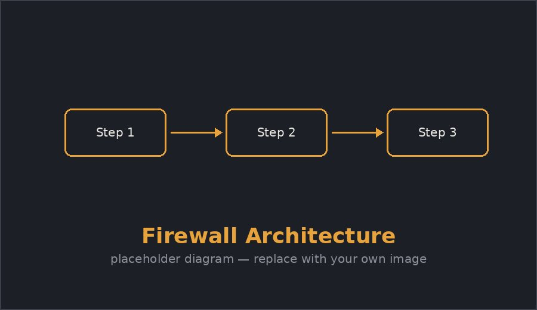

# Firewall

A firewall is a network security device that monitors incoming and outgoing traffic and decides whether to allow or block it, based on a defined set of rules.



## Types of firewalls

1. **Packet-filtering firewalls** — inspect headers only (IP, port, protocol)
2. **Stateful inspection firewalls** — track the state of active connections
3. **Proxy firewalls** — act as an intermediary, terminating the connection themselves
4. **Next-generation firewalls (NGFW)** — add deep packet inspection, intrusion prevention, and application awareness

## Example rule set

A simplified rule table for an inbound policy:

| Rule | Source | Destination port | Action |
|---|---|---|---|
| 1 | Any | 22 (SSH) | Deny |
| 2 | Internal LAN | 443 (HTTPS) | Allow |
| 3 | Any | 80 (HTTP) | Allow |
| 4 | Any | Any (default) | Deny |

The **default deny** rule at the bottom matters most — it's what makes the firewall secure by default rather than secure by exception.

## Sample iptables snippet

```bash
# Allow established connections
iptables -A INPUT -m state --state ESTABLISHED,RELATED -j ACCEPT

# Allow HTTPS inbound
iptables -A INPUT -p tcp --dport 443 -j ACCEPT

# Drop everything else
iptables -A INPUT -j DROP
```

## Limitations

> A firewall only inspects traffic that passes *through* it — it does nothing against threats that originate from inside the trusted network.

- [x] Understand packet vs. stateful filtering
- [x] Write a basic default-deny rule set
- [ ] Explore NGFW deep packet inspection
- [ ] Look at host-based firewalls vs. network firewalls

---

Same diagram via Obsidian embed syntax: ![[firewall.jpg]]
